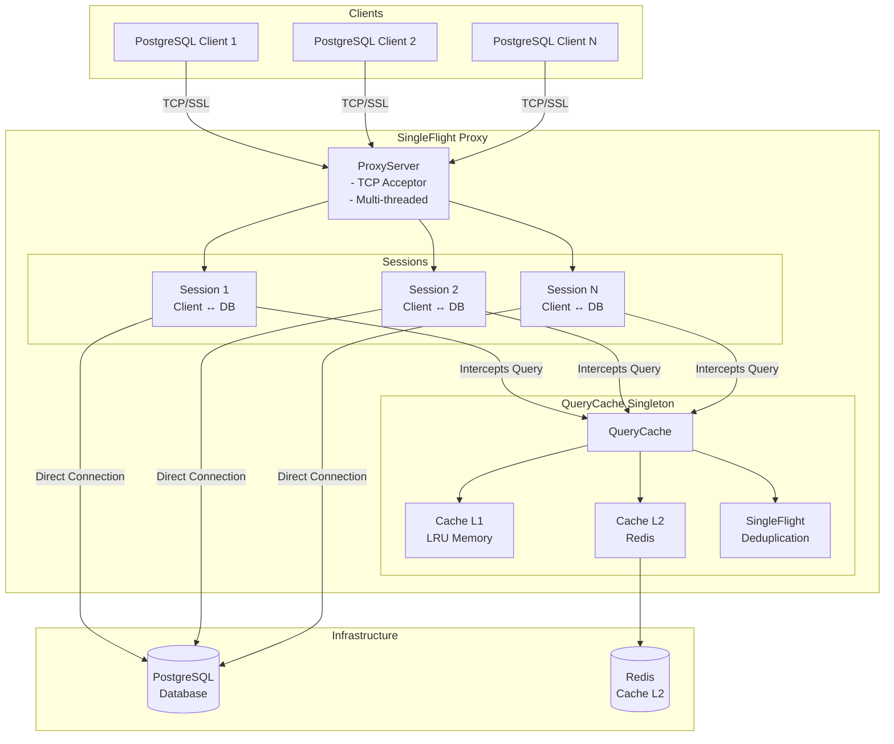
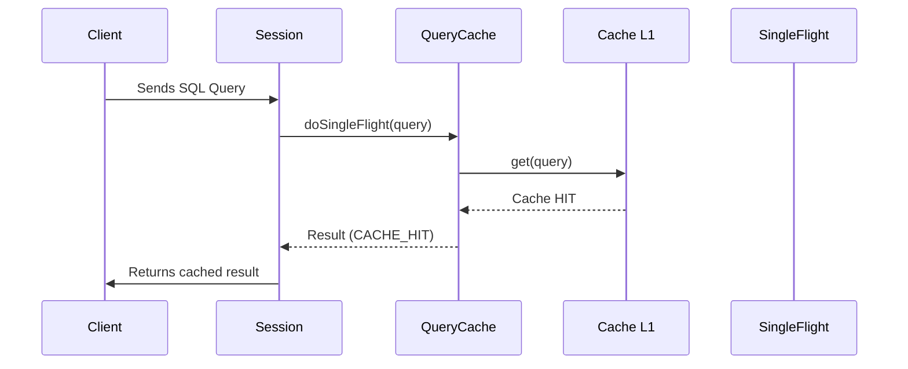
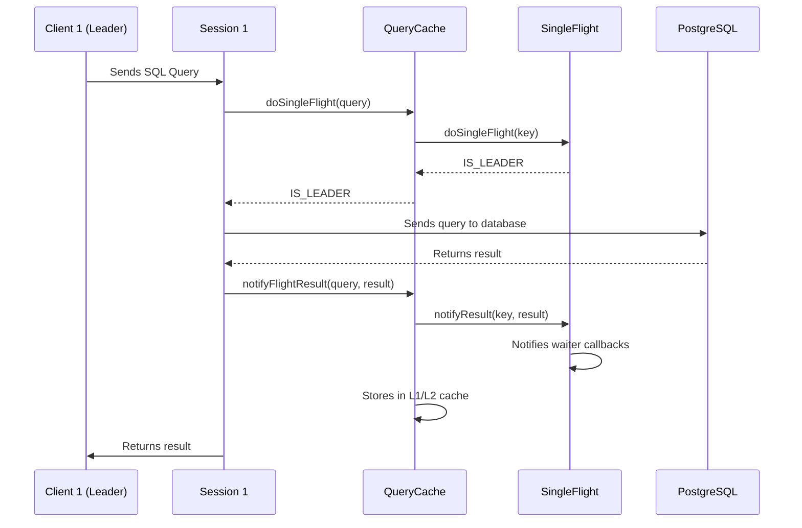
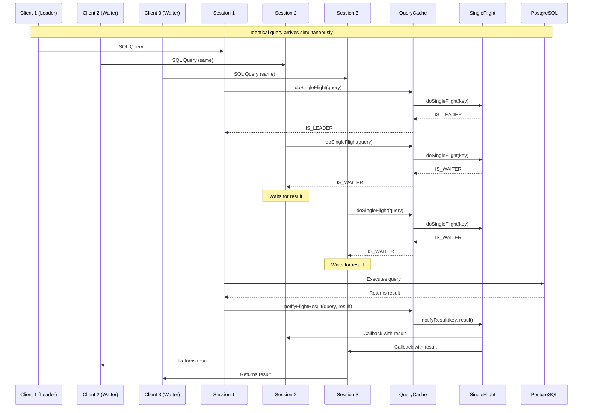
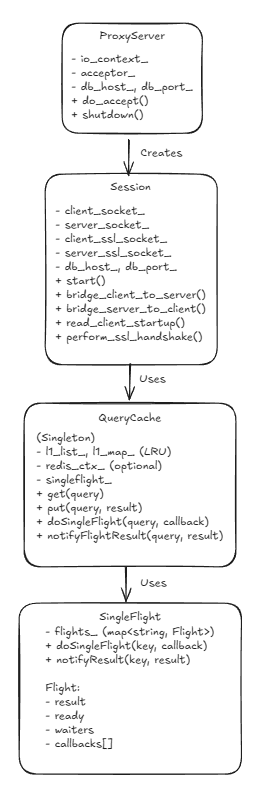

# SingleFlight Proxy Server

PostgreSQL proxy server that implements the **SingleFlight** pattern to avoid duplicate executions of identical queries, significantly reducing database load in high-concurrency scenarios.

## Features

- **SingleFlight Pattern**: Deduplicates identical simultaneous queries
- **Multi-Layer Cache**: L1 (local memory) + L2 (optional Redis)
- **SSL/TLS**: Full support for encrypted connections
- **Asynchronous**: Built on Boost.Asio for high performance
- **Multi-threaded**: Supports multiple worker threads

## Requirements

- **Compiler**: GCC/G++ with C++20 support or higher (GCC 10+ recommended)
- **Boost.Asio**: Boost library
- **spdlog**: Fast C++ logging library (header-only)
- **OpenSSL**: For SSL/TLS support
- **yaml-cpp**: For configuration parsing (optional, can use defaults)
- **hiredis**: For L2 cache with Redis (optional)
- **System**: Linux, Windows, or macOS

### Installation on Linux (Ubuntu/Debian)

```bash
sudo apt-get update
sudo apt-get install build-essential libboost-all-dev libspdlog-dev libssl-dev libyaml-cpp-dev
```

For Redis support (optional):
```bash
sudo apt-get install libhiredis-dev
```

**Note:** If Boost is in another location, set the variable:
```bash
export BOOST_ROOT=/path/to/boost
make
```

## Compilation

### Build the project

```bash
make
```

### Build and run

```bash
make run
```

### Clean compiled files

```bash
make clean
```

### Rebuild everything

```bash
make rebuild
```

## Usage

### Run the proxy

```bash
./bin/singleflight-proxy [config.yaml]
```

By default, the proxy:
- **Listens on port**: 6000
- **Redirects to**: PostgreSQL at `127.0.0.1:5432`

### Connect to the proxy

Configure your PostgreSQL client to connect to:
```
Host: 127.0.0.1
Port: 6000
```

The proxy automatically redirects to the real PostgreSQL on port 5432.

## Configuration

The proxy uses a YAML file for configuration. Example (`config.yaml`):

```yaml
server:
  listen_port: 6000
  listen_address: "0.0.0.0"
  num_threads: 4

database:
  host: "127.0.0.1"
  port: 5432

cache:
  l1:
    max_size: 1000
    enabled: true
  l2:
    redis:
      enabled: true
      host: "127.0.0.1"
      port: 6379
      timeout_ms: 1000

logging:
  level: "info"
  pattern: "[%Y-%m-%d %H:%M:%S.%e] [%^%l%$] %v"

ssl:
  enabled: true
  verify_mode: "none"
```

### Configuration Parameters

- **server.listen_port**: Port where the proxy listens
- **server.listen_address**: IP address to listen on (0.0.0.0 = all interfaces)
- **server.num_threads**: Number of worker threads
- **database.host**: PostgreSQL host
- **database.port**: PostgreSQL port
- **cache.l1.max_size**: Maximum L1 cache size (LRU)
- **cache.l1.enabled**: Enable/disable L1 cache
- **cache.l2.redis.enabled**: Enable L2 cache with Redis
- **cache.l2.redis.host**: Redis host
- **cache.l2.redis.port**: Redis port
- **logging.level**: Log level (trace, debug, info, warn, error)
- **ssl.enabled**: Enable SSL/TLS support

## Architecture

### Overview

The proxy acts as an intermediary between PostgreSQL clients and the database server, intercepting SQL queries and implementing intelligent caching with deduplication.

### Component Diagram



### Detailed Data Flow

#### Flow 1: Query with Cache Hit



#### Flow 2: Query Miss - Leader (First Query)



#### Flow 3: Query Miss - Waiters (Duplicate Queries)



### Main Components

#### 1. **ProxyServer**
- Accepts connections from PostgreSQL clients
- Creates a `Session` for each connected client
- Manages session lifecycle

#### 2. **Session**
- Manages two connections: Client ↔ Proxy and Proxy ↔ Database
- Implements bidirectional data bridge
- Intercepts SQL packets (type 'Q')
- Supports SSL/TLS in both directions

#### 3. **QueryCache**
- Singleton that manages query cache
- **Cache L1**: LRU in memory (fast, local)
- **Cache L2**: Redis (optional, distributed)
- Integrates with SingleFlight for deduplication

#### 4. **SingleFlight**
- Implements the SingleFlight pattern
- When multiple identical queries arrive simultaneously:
  - **Leader**: First query executes on database
  - **Waiters**: Other queries wait for result
  - All receive the same result when ready

### Class Structure



### Threading Model

#### Overview

The proxy uses a **single shared `io_context`** with multiple worker threads. This allows parallel processing of asynchronous callbacks while maintaining automatic load balancing.


#### Async Operation Flow

Here's what happens when a Session performs an async operation:

```
1. Session calls async_read_some()
   │
   ▼
2. Boost.Asio schedules I/O operation on io_context
   │
   ▼
3. OS waits for data (non-blocking, thread continues)
   │
   ▼
4. Data arrives → OS notifies io_context
   │
   ▼
5. io_context adds callback to ready queue
   │
   ▼
6. Any available worker thread picks up callback
   │
   ▼
7. Worker thread executes callback
   │
   ▼
8. Session processes the data
```

## How It Works

### 1. Initialization
- ProxyServer starts and begins accepting connections
- QueryCache is initialized as singleton
- Worker threads are created to process asynchronous I/O

### 2. Client Connection
- Client connects to proxy
- ProxyServer creates a new Session
- Session creates direct connection to database

### 3. SSL Handshake (if enabled)
- Client may request SSL
- Session negotiates SSL with client and server
- Creates SSL streams for both connections

### 4. Query Interception
- Session monitors client traffic
- Detects SQL packets (type 'Q')
- Extracts SQL query from packet

### 5. Cache Processing
- QueryCache checks L1 cache (memory)
- If miss, checks L2 cache (Redis, if enabled)
- If still miss, uses SingleFlight for deduplication

### 6. Data Bridge
- Data flows bidirectionally between client and database
- Query responses are intercepted and cached
- SingleFlight notifies waiters when result is ready

## Benefits

1. **Reduced Database Load**: Duplicate queries are executed only once
2. **Better Performance**: Cache reduces latency for frequent queries
3. **Scalability**: Supports high concurrency with multiple threads
4. **Transparency**: Clients require no modifications
5. **Flexibility**: L2 cache (Redis) enables distributed caching

## Technical Notes

- **Asynchronous**: All I/O is asynchronous using Boost.Asio
- **Thread-Safe**: QueryCache and SingleFlight are thread-safe
- **LRU Cache**: L1 cache uses LRU algorithm to manage memory

## Performance Considerations

1. **Asynchronous**: All I/O is non-blocking
2. **Cache L1**: O(1) access with hash map
3. **LRU**: Automatic eviction when cache full
4. **SingleFlight**: Prevents N identical simultaneous queries
5. **Multi-threaded**: Parallelizes I/O processing

## Known Limitations

1. **Direct Connections**: Each session = 1 database connection
2. **Cache L1**: Limited to process memory
3. **Cache L2**: Requires Redis for distribution
4. **SSL**: Auto-generated certificates (not for production yet)

## Future Improvements

### Monitoring and Observability
- HTTP endpoints for metrics (`/metrics`, `/health`, `/stats`) in Prometheus format
- Expanded metrics (query latency, connection stats, error rates)

### Performance and Scalability
- Query result streaming for large result sets
- Batch processing for multiple small queries
- Configurable TTL per query pattern
- Cache warming (preload frequent queries)

### Security
- Authentication and authorization
- Query sanitization and SQL injection detection
- Audit logging (complete query log)
- Real SSL certificates (production-ready)

### High Availability
- Automatic failover to multiple PostgreSQL backends
- Circuit breaker pattern for failure handling
- Connection health checks and automatic recovery

### Advanced Features
- Query rewriting and optimization(Maybe)
- Slow query detection and analysis
- Intelligent cache invalidation (pattern-based)
- Read/write splitting (route reads to replicas)

### Operational
- Docker and Kubernetes support
- Structured logging (JSON format)
- Hot reload configuration (reload without restart)

## Testing

The project includes test scripts:
- `test_concurrent.sh`: Tests concurrency, Leader and Waiters logic

## Available Make Commands

- `make` - Build the project
- `make clean` - Remove compiled files
- `make rebuild` - Clean and rebuild everything
- `make run` - Build and run the program
